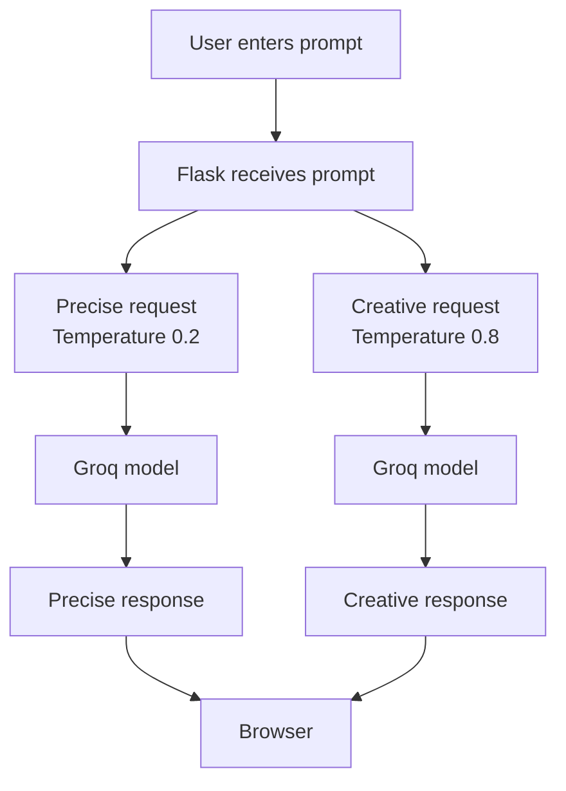

# 03 - Creative vs Precise AI

Welcome to **Project 03** of the 30-Day LLM Challenge! In this project, you will explore one of the most fundamental generation parameters in Large Language Models (LLMs): **Temperature**.

---

## 🎯 Project Goal

The primary goal of this application is to send the **EXACT SAME** prompt to an LLM twice using different temperature settings:
1. **Precise AI** (`temperature = 0.2`): Generates a focused, deterministic, and consistent response.
2. **Creative AI** (`temperature = 0.8`): Generates a varied, imaginative, and creative response.

By displaying both outputs side-by-side, you can observe firsthand how adjusting a single parameter transforms the behavior of an AI model.

---

## 🎓 What You Will Learn

- **What Temperature Is**: Understand how temperature controls word selection probability in LLMs.
- **Controlled Experimentation**: Learn how keeping the model, prompt, and system instructions constant isolates temperature as the single variable.
- **Model Fallback Strategy**: Learn how production apps handle unavailable API models seamlessly.
- **Dynamic Model Tracking**: Display which AI model actually generated each response.
- **Flask Web Development**: Connect a Python web server to the official Groq API SDK.

---

## 🧠 What Is This Project?

This is a beginner-friendly web application built with **Python, Flask, HTML, and CSS**. When you type a prompt and click **Compare Responses**, the backend triggers two independent API calls to Groq's high-speed inference engines:
- Call #1 asks the model for an answer using a low temperature setting (`0.2`).
- Call #2 asks the model for an answer using a high temperature setting (`0.8`).

Both responses are delivered back to your browser side-by-side in real time.

---

## ❓ Why Are We Building It?

When beginners build LLM applications, they often wonder why the AI gives different answers to the same question, or how to make an AI act more reliably versus more creatively.

Instead of reading theoretical definitions, building this application allows you to **see and feel the difference** through live interactive experimentation.

---

## 🌡️ What Is Temperature?

When an LLM generates text, it doesn't choose sentences all at once. Instead, it predicts text word-by-word (or token-by-token) by calculating probabilities for every possible next word.

**Temperature** is a hyperparameter that scales these probabilities before picking the next word:
- **Low Temperature (e.g., 0.2)**: Sharpens the probabilities. The model almost always picks top-ranked, highly predictable words.
- **High Temperature (e.g., 0.8)**: Flattens the probabilities. The model picks from a wider variety of words, introducing randomness and novelty.

> [!NOTE]
> Temperature does not make a model "smarter" or "dumber". It simply changes how adventurous the model is when selecting the next word.

---

## 🔍 Precise vs Creative Responses

| Setting | Temperature | Characteristics | Best Used For |
| :--- | :--- | :--- | :--- |
| **Precise AI** | `0.2` | Focused, consistent, factual, direct | Math, coding, summarization, factual QA |
| **Creative AI** | `0.8` | Varied, expressive, imaginative, novel | Storytelling, brainstorming, poetry, naming |

---

## 🤖 What Is an LLM?

An **LLM (Large Language Model)** is a deep learning model trained on massive amounts of text data to understand and generate human language. Examples include GPT-4, Llama 3.3, and Groq's open-weights models.

---

## 🔑 What Is an API?

An **API (Application Programming Interface)** is a bridge that allows two software systems to communicate. In this project, our Flask app uses the Groq API to request AI completions over the internet.

---

## 🔐 What Is an API Key?

An **API Key** is a unique secret passcode that authenticates your app with the service provider (Groq). It ensures that your requests are authorized.

> [!CAUTION]
> Never share your API key publicly or commit it to GitHub. Keep it stored safely inside your `.env` file.

---

## 🛠️ Technologies Used

- **Python 3.10+**: Core programming language.
- **Flask**: Lightweight Web framework for handling HTTP requests.
- **Groq Python SDK**: Official SDK to communicate with Groq LPUs.
- **python-dotenv**: Tool to load secrets securely from `.env`.
- **HTML5 & CSS3**: Modern dark-mode user interface.

---

## 🏗️ Project Structure

```
03. Creative vs Precise AI/
│
├── app.py                          # Flask application & Groq API logic
├── requirements.txt                # Python dependencies
├── .env                            # Secret environment variables (API key)
├── run.bat                         # One-click Windows launcher
├── README.md                       # Comprehensive guide & documentation
│
├── templates/
│   └── index.html                  # Main UI template
│
└── static/
    └── style.css                   # Custom CSS styling
```

---

## 🔄 Complete End-to-End Workflow



---

## 🧪 What Exactly Changes in This Experiment?

To conduct a valid scientific experiment, you must isolate a single variable:

- **Controlled Variables (Unchanged)**:
  - User Prompt
  - System Instructions
  - AI Model Family
  - API Provider
- **Experiment Variable (Changed)**:
  - **Temperature** (`0.2` vs `0.8`)

This guarantees that any difference in output style is caused by the temperature setting alone.

---

## 🧩 How the Python Code Works

The backend logic in `app.py` is straightforward:

1. **Loads `.env`** to retrieve `GROQ_API_KEY`.
2. Defines `MODELS` fallback sequence:
   - `openai/gpt-oss-120b`
   - `openai/gpt-oss-20b`
   - `llama-3.3-70b-versatile`
   - `llama-3.1-8b-instant`
3. Defines a shared `SYSTEM_PROMPT` instructing the AI to provide readable, concise responses.
4. When a prompt is submitted, `call_groq_with_fallback()` executes twice:
   - Once with `PRECISE_TEMP = 0.2`
   - Once with `CREATIVE_TEMP = 0.8`
5. Renders `index.html` with both responses and the actual models utilized.

---

## 🤖 How the Groq API Call Works

The request uses the Chat Completions API via the official Python SDK:

```python
response = client.chat.completions.create(
    model=model,
    messages=[
        {"role": "system", "content": SYSTEM_PROMPT},
        {"role": "user", "content": prompt}
    ],
    temperature=temperature
)
```

The response content is extracted from `response.choices[0].message.content`.

---

## 🔁 How Model Fallback Works

If a primary model is temporarily overloaded or deprecated, `call_groq_with_fallback()` automatically loops through the fallback model list until a working model responds:

```
[Primary Model] ---> (If error) ---> [Fallback Model 1] ---> (If error) ---> [Fallback Model 2]
```

If an authentication error occurs (invalid API key), the fallback loop terminates immediately and alerts the user.

---

## 🖥️ How the Web Page Works

The web frontend (`index.html`) consists of:
- A text area for entering custom prompts.
- Quick-select buttons for sample prompts ("Try these prompts").
- Two side-by-side response cards formatted with dynamic badges showing:
  - Target Temperature (`0.2` vs `0.8`)
  - Actual Model Used (e.g., `openai/gpt-oss-120b`)

---

## 💻 Manual Setup

If you prefer setting up manually without using `run.bat`:

1. Open your terminal in the project folder:
   ```cmd
   cd "g:\Nobeth Analytics\Projects\Mini AI apps\Projects\03. Creative vs Precise AI"
   ```
2. Create a virtual environment:
   ```cmd
   python -m venv 03_creative_vs_precise_ai
   ```
3. Activate the environment:
   ```cmd
   03_creative_vs_precise_ai\Scripts\activate
   ```
4. Install dependencies:
   ```cmd
   pip install -r requirements.txt
   ```
5. Create a `.env` file and insert your API key:
   ```env
   GROQ_API_KEY=gsk_your_actual_api_key_here
   ```

---

## ▶️ Manual Run

With the virtual environment activated, launch Flask:
```cmd
python app.py
```
Open your browser and navigate to: [http://127.0.0.1:5000](http://127.0.0.1:5000)

> [!NOTE]
> To run the complete application, start Flask using run.bat or the manual Python command. A static HTML preview does not replace the Flask backend or Groq API connection.

---

## 🪄 One-Click Windows Run

For instant execution on Windows:
1. Double-click `run.bat`.
2. The launcher will automatically verify Python, set up the virtual environment, install dependencies, prompt for your API key if missing, start Flask, and open your browser automatically.

---

## 🔑 How to Get a Groq API Key

1. Go to [https://console.groq.com](https://console.groq.com)
2. Sign in or create a free account.
3. Navigate to **API Keys** in the dashboard.
4. Click **Create API Key**.
5. Copy your key (starts with `gsk_`) and paste it when prompted by `run.bat` or add it to `.env`.

---

## 🔄 What Happens on the Second Run?

After the first successful setup, you can simply double-click run.bat again. The launcher reuses the environment and configuration already created for this project, starts the application, and takes you to the local application URL without repeating unnecessary setup.

---

## 🧪 How to Experiment With the App

Try these prompts to see how temperature affects different types of tasks:

1. **Creative Task**:
   > *"Write a short story about a robot discovering the ocean."*
   - *Observation*: Creative AI will use richer metaphors and unexpected plot twists.

2. **Brainstorming Task**:
   > *"Give me 5 creative ideas for a mobile app."*
   - *Observation*: Precise AI gives standard practical apps; Creative AI gives wild, unconventional ideas.

3. **Factual Task**:
   > *"Explain why the sky looks blue in simple terms."*
   - *Observation*: Precise AI provides concise, structured physics facts.

---

## ❌ Common Errors

- **Missing API Key**: The `.env` file does not contain a valid `GROQ_API_KEY`.
- **Invalid API Key**: The API key pasted is incorrect or revoked (`AuthenticationError`).
- **Port 5000 Occupied**: Another process is using port 5000. Close the other server or change the port in `app.py`.

---

## 🔧 Troubleshooting

| Problem | Cause | Fix |
| :--- | :--- | :--- |
| `python` not recognized | Python not in system PATH | Reinstall Python and check "Add Python to PATH" |
| Groq API error | Invalid key or network issue | Check internet connection and verify `.env` key |
| Terminal text garbled | Unicode emoji issue | `run.bat` uses clean ASCII tags to prevent encoding bugs |

---

## 📚 Beginner Glossary

- **Temperature**: Hyperparameter controlling randomness in word selection.
- **LLM**: Large Language Model trained to process and generate natural language.
- **Groq**: AI hardware and cloud platform delivering high-speed LPU inference.
- **Flask**: Python web application framework.
- **Virtual Environment (venv)**: Isolated folder containing Python packages for a specific project.

---

## 📖 How to Study This Project

1. Open `app.py` and inspect how `PRECISE_TEMP` (`0.2`) and `CREATIVE_TEMP` (`0.8`) are passed to Groq.
2. Open `templates/index.html` to see how dynamic model badges are rendered.
3. Open `static/style.css` to see card styling.
4. Modify `PRECISE_TEMP` to `0.0` or `CREATIVE_TEMP` to `1.0` in `app.py` and re-run to observe extreme values!

---

## ✅ Final Checklist

- [x] Project 03 isolated in its own workspace.
- [x] Flask backend running on `http://127.0.0.1:5000`.
- [x] Same prompt sent to low (0.2) and high (0.8) temperatures.
- [x] Dynamic display of models actually used.
- [x] Automatic model fallback list configured.
- [x] One-click `run.bat` setup with second-run efficiency.
- [x] Responsive dark-mode UI with non-blocking sample prompts.
"# Creative-vs-Precise-AI" 
